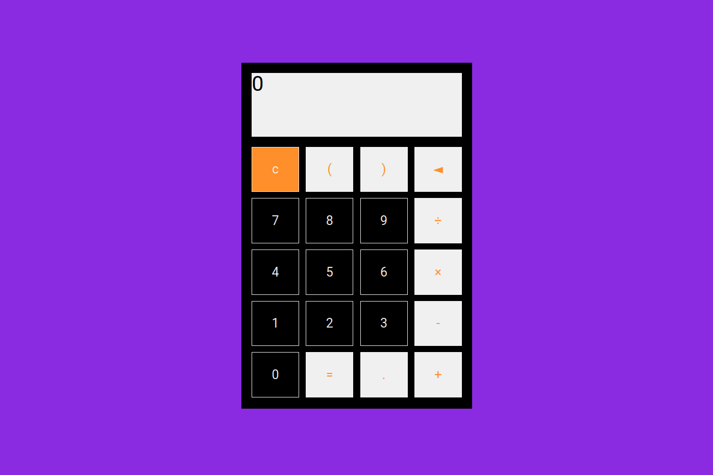

# Calculator

----------------------------------------------------------------------------------------------

----------------------------------------------------------------------------------------------
